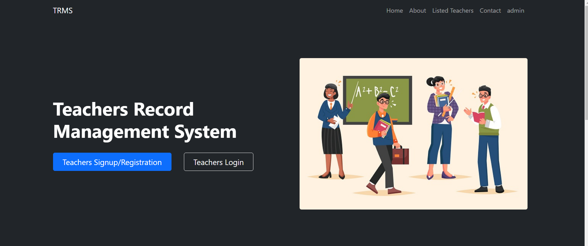

# Teacher Management System

## Overview
The Teacher Management System is a web-based application designed to streamline the management of teacher, student, and administrative tasks within an educational institution. The system allows teachers to manage student details, handle queries, and more, while administrators have overarching control over the entire system, including managing teachers and assigning subjects.

## Features
- **Teacher Module:**
  - Add and delete student details such as personal information, marks, and grades.
  - Manage student queries and doubts.
  
- **Student Module:**
  - Submit queries and doubts to teachers.

- **Admin Module:**
  - Delete teacher records.
  - Add subjects and assign teachers to subjects.
  - Overall control over the management system.

## Technologies Used
- **Frontend:** HTML, CSS, JavaScript
- **Backend:** PHP
- **Database:** MySQL
- **Server:** XAMPP

## Usage
1. **Admin Login:**
   - Access the admin panel to manage teachers and subjects.
   
2. **Teacher Login:**
   - Manage student details and respond to queries.
   
3. **Student Login:**
   - Submit queries to teachers.

## Screenshots
*Screenshots will be added here.*

## Documentation
*Documentation will be added here.*

- [User Guide](docs/user_guide.pdf)
- [Admin Guide](docs/admin_guide.pdf)
- [Developer Guide](docs/developer_guide.pdf)

## Contact
For any inquiries or feedback, please contact:
- **Name:** [Vipin Hegde](vipinhegde@gail.com)
- **linkedin:** [Vipin Hegde](https://www.linkedin.com/in/vipin-hegde/)
- **Github:** [Vipin Hegde](https://github.com/vipinhegde19)

---

Feel free to explore, use, and contribute to the Teacher Management System!
